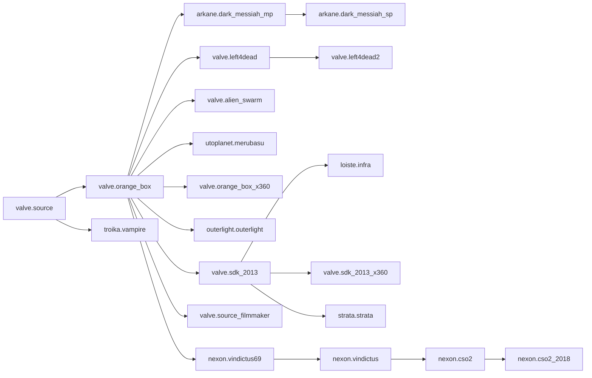

# Source Engine

Valve's legacy

## Branches
> TODO: embed a branch script relationship timeline html snippet  
> -- w/ links to elsewhere in the wiki  
> -- mermaid isn't up to the task

## Games
> TODO: embed a games timeline snippet
